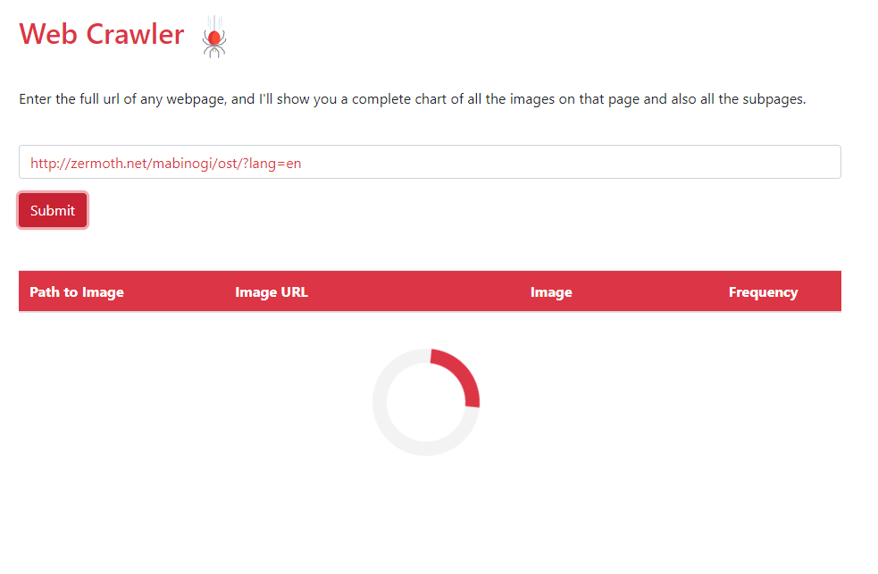
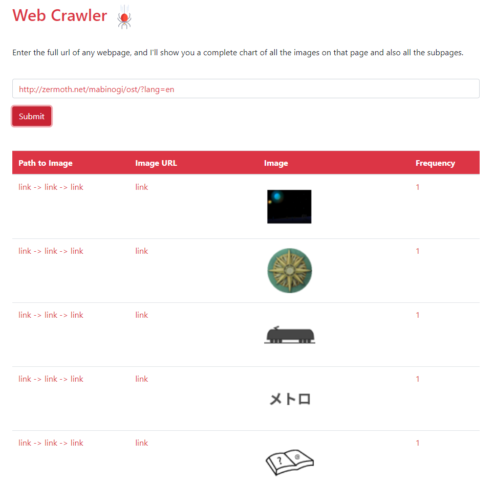
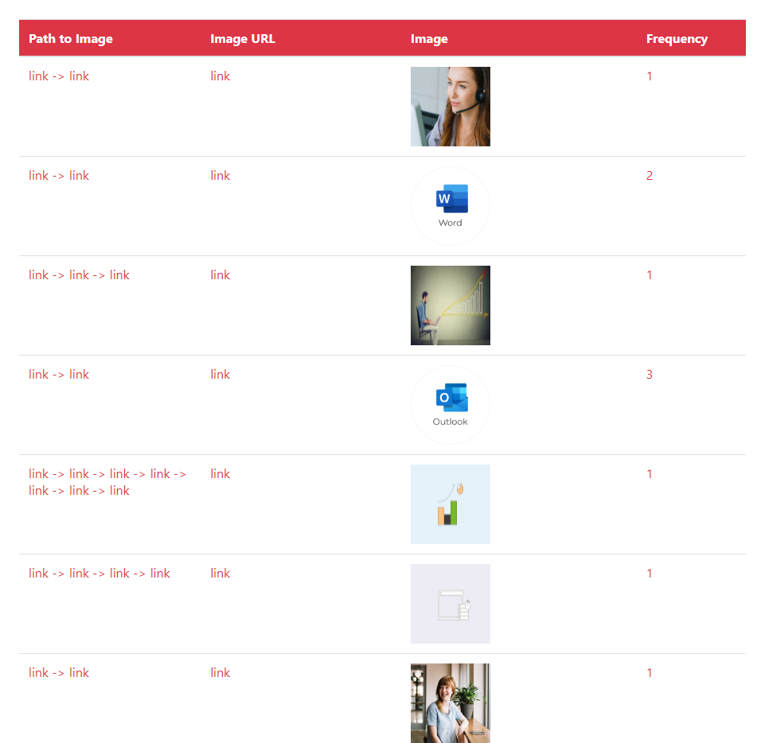

## ImageFinder
The ImageFinder Application performs a web crawl on a URL string provided by the user. From the crawl, all of the images on that web page will be parsed out and return a JSON array of strings that represent the URLs of all images on the page

### Setup
To build the project, run the command:

>`mvn package`

To clear 'target' directory, you may run the command:

>`mvn clean`

To run the project, use the following command to start the server:

>`mvn clean test package jetty:run` 

## Examples

 

*Image of the URL being entered and loaded into the web-crawler* 

 

 

*Image of the output table from a web-crawl showing the image, the link path, and the frequency with which the image appears* 

 

 

*Another table being shown of the result from an image web-crawl for another link*
